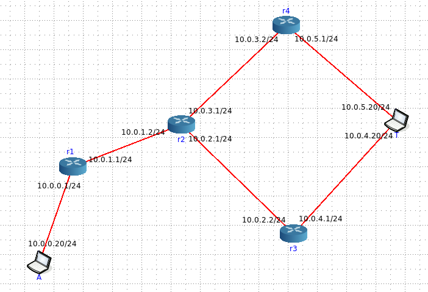

# TCP Segmentation - Scenario4



- [Script](script.py) used to generate the attack attempt
- Suricata [analysis](suricata/)
- Snort [analysis](snort)
- r3 [pcap](r3_eth1.pcapng)
- r4 [pcap](r4_eth1.pcapng)
- [Server logs](httpd.log)
- Topology [configuration](topology.toml)

## Commands Executed

- At **T**arget node
```
./mini_httpd -l httpd.log
```

- At **A**ttacker node
```
python3 script.py 10.0.5.20 10.0.0.1
```

---
- Suricata analysis generated with 
```
suricata -r r3_eth1.pcapng > summary.txt
suricata -r r4_eth1.pcapng > summary.txt
```

- Snort analysis generated with
```
snort -r r3_eth1.pcapng -A alert_fast -R /etc/snort/rules/snort.rules -c /etc/snort/snort.lua > summary.txt
snort -r r4_eth1.pcapng -A alert_fast -R /etc/snort/rules/snort.rules -c /etc/snort/snort.lua > summary.txt
```
