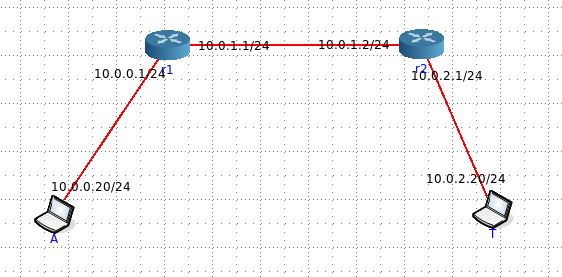

# TCP Segmentation - Scenario2



- [Script](script.py) used to generate the attack attempt
- Suricata [analysis](suricata/)
- Snort [analysis](snort)
- r2 [pcap](r2_eth1.pcapng)
- [Server logs](httpd.log)
- Topology [configuration](topology.toml)

## Commands Executed

- At **T**arget node
```
./mini_httpd -l httpd.log
```

- At **A**ttacker node
```
python3 script.py 10.0.2.20
```

---
- Suricata analysis generated with 
```
suricata -r r2_eth1.pcapng > summary.txt
```

- Snort analysis generated with
```
snort -r r2_eth1.pcapng -A alert_fast -R /etc/snort/rules/snort.rules -c /etc/snort/snort.lua > summary.txt
```
